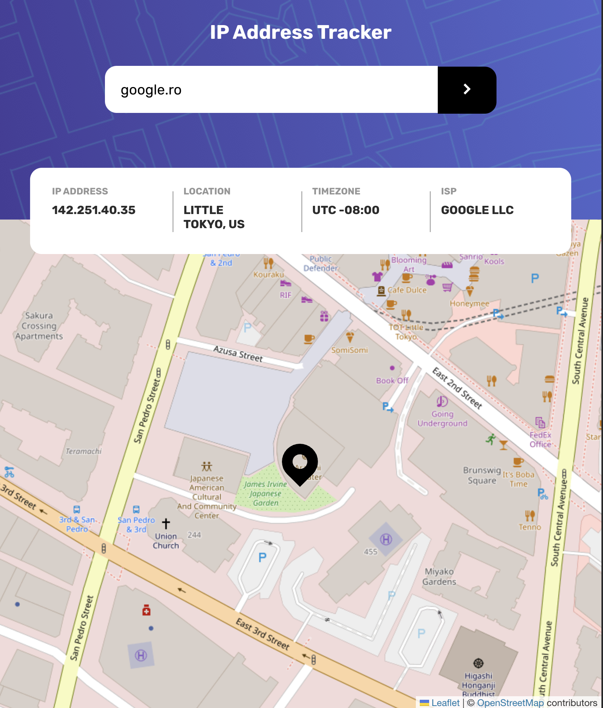

# IP address tracker solution

This is an IP-based geolocation application that is meant to provide certain information in regard to the provided IP.

Note: IP-based geolocation services can obtain 95 percent to 99 percent accuracy of a user's country, and 55 percent to 80 percent accuracy for a user's region or state.

## Overview

### Screenshot



### Links

- Solution URL: [Git Repo](https://github.com/NickBlkPan/ip_tracker)
- Live Site URL: [Github Pages](https://nickblkpan.github.io/ip_tracker/)

## My process

### Built with

- Semantic HTML5 markup
- Flexbox
- Mobile-first workflow
- [React](https://reactjs.org/) - JS library

### Showcase

```
export const getApiKeys = async () => {
    const documentReference = await doc(firestore, 'apiKeys', 'geoApi');
    const geoApiKey = await getDoc(documentReference).then(geoApiData => geoApiData.get('key'));

    return {
        [API_KEYS.GEO_API]: geoApiKey
    }
}
```
The most usual thing in regard to API keys that I've seen in Frontend projects is that, the developer chooses to use the dotenv package to store the API keys, as specially when the project has no Backend. What I like to do when the project has no Backend, is store the API keys in a 3rd party database, in this case Firebase, and request the API keys in the Frontend application. Then I restrict access so that the 3rd part only accepts API calls from wherever the Frontend will be deployed.  

### Potential improvements

Projects benefit from a Mobile-first approach, a potential improvement for the project could be another practice that I think is very valuable, and didn't implement because of time limitation, Test Driven Development.

## Author

- Nicolae Balica
